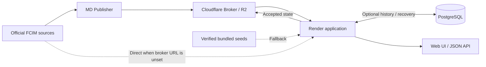

# Orar FCIM UTM

A timetable web app for **FCIM UTM students in Anul I and Anul II**, built from
schedule PDFs published on the [official FCIM timetable page](https://fcim.utm.md/procesul-de-studii/orar/).
Choose your course year and group to see your classes on desktop or mobile.

[](https://github.com/barbalatv/utm-curs-i-orar-2027/actions/workflows/ci.yml)
[](LICENSE)

**[Open the live timetable →](https://utm-curs-i-orar-2027.onrender.com)**

This is an independent project, not an official UTM service.

## What it does

The app turns FCIM's PDF tables into a searchable timetable. Each course year has its
own schedule and update status. You can follow the source link and check when the
displayed timetable was last updated.

## Features

- Switch between **Anul I** and **Anul II** and select a group.
- Browse **Today**, **Week**, or **all-groups** views.
- Search by group, teacher, subject, or room.
- See odd/even week lessons and labels such as **Curs**, **Seminar**, **Laborator**,
  and **Activități Individuale/În Grup**.
- Keep your selected course year and each course's group preference in your browser.
- Use a responsive interface designed for phones as well as larger screens.

## How schedule updates work

Official FCIM PDFs are transformed into structured timetable data. The parser reconstructs
table geometry—group columns, day blocks, merged cells, and half-cell week patterns—rather
than treating the PDF as one stream of text. New candidates pass course and schedule
validation before replacing the currently accepted timetable.

The app checks for updates periodically (every 30 minutes by default). If fetching or
validation fails, it can continue serving the last accepted schedule. Local storage,
optional PostgreSQL recovery, broker accepted state, and verified bundled seeds provide
layers of recovery across restarts. A recovered timetable may be older than the latest
FCIM publication; check its source and update status when freshness matters.

## Local development

Use **Node.js 22**, matching CI and the application container. From the repository root:

```text
npm ci
npm run dev
```

Open [localhost:3000](http://localhost:3000). These commands work in PowerShell and POSIX
shells. Basic startup does not require an `.env` file, a database, or broker credentials.
Both course years are enabled by default. Startup attempts recovery before background updates.

[`.env.example`](.env.example) is optional configuration. To customize it in PowerShell:

```powershell
Copy-Item .env.example .env
```

Normal deployments require **zero `SCHEDULE_SEED_*` variables**: the release supplies the
verified seeds. Configure `SCHEDULE_ODD_WEEK_ANCHOR` for the semester's odd-week calendar
when needed. See [configuration and deployment](docs/debugging.md#configuration-and-deployment)
for storage, Docker, and broker setup.

## Testing

Run the checks appropriate to the change; the [CI workflow](.github/workflows/ci.yml)
combines these tiers with linting and builds.

| Tier | Commands and prerequisites |
| --- | --- |
| Application types and unit/parser tests | `npm run typecheck`, `npm test` (Vitest with local fixtures and mocked upstream requests) |
| PostgreSQL 16 integration | Set `DATABASE_URL` to a disposable test database; run `npm run db:migrate`, then `npm run test:db` |
| Browser E2E | `npm run build`, `npx playwright install chromium`, then `npm run test:e2e` (Playwright) |
| Workers | `npm run typecheck:worker`, `npm run typecheck:worker-egress`, `npm run check:worker`, `npm run check:worker-egress` (Wrangler dry runs; no deployment) |
| MD Publisher | `npm run typecheck:publisher`, `npm run build:publisher` |

See [testing and parser diagnostics](docs/debugging.md#testing-and-parser-diagnostics)
for PowerShell database setup and PDF inspection commands.

## Architecture

The application uses **Next.js, React, and TypeScript**, with `pdfjs-dist` for PDF extraction
and Zod for structured data validation. **Cloudflare Broker + R2 is the current recommended
production topology**. MD Publisher supplies raw official source material; the Render
application remains the semantic authority that selects, parses, and validates it.



The broker is optional: when `SCHEDULE_BROKER_URL` is unset, automatic updates use the
direct FCIM transport. `SCHEDULE_BROKER_SECRET` is needed for authenticated accepted-state
writes in broker mode, not for universal application startup. PostgreSQL is optional
history and recovery storage; browser/API reads use the current local schedule.

The effective cold-start recovery order is:

**In-memory/current cache → scoped local schedule → compatible legacy cache adoption
→ PostgreSQL current/history recovery → broker durable accepted state → verified bundled seed.**

The scheduler and cache coordination run within one process; deploy one application replica.
See [architecture](docs/architecture.md) for update ordering, recovery, and maintenance.

## API

Read endpoints return JSON. Except for health, each accepts `?course=1` or `?course=2`
when that course is enabled. Omitting it uses the configured default (Anul I with default
settings); invalid or repeated selectors return `400`.

| Endpoint | Returns |
| --- | --- |
| `GET /api/health` | Process liveness and per-course schedule availability |
| `GET /api/status?course=1` | Schedule summary and update diagnostics |
| `GET /api/groups?course=2` | Available groups and lesson counts |
| `GET /api/schedule?course=2` | Lessons and metadata; filters: `group`, `day`, `teacher`, `subject`, `room`, `q` |
| `GET /api/schedule/{group}?course=2` | A group's lessons, also grouped by day |
| `GET /api/schedule/{group}/today?course=2` | Lessons for today's weekday in Europe/Chisinau |
| `GET /api/source?course=2` | Source PDF URL, hash, timestamps, and update state |

See [API behavior](docs/debugging.md#public-api-behavior) for response details and errors.

## Documentation

- [Architecture](docs/architecture.md): course model, transport, validation, persistence, and retention.
- [Debugging and operations](docs/debugging.md): diagnostics, configuration, recovery, and testing.
- [MD Publisher operations](docs/publisher.md): installation, credentials, scheduling, and troubleshooting.
- [Publisher quick reference](tools/md-publisher/README.md): build and CLI commands.

## License and data sources

Repository source code is licensed under the [MIT License](LICENSE). Timetable PDFs and
data originate from [UTM/FCIM sources](https://fcim.utm.md/procesul-de-studii/orar/);
these third-party materials are **not licensed under this project's MIT license**.
Bundled PDF provenance and hashes are recorded in [architecture](docs/architecture.md#bundled-seeds-and-provenance).
