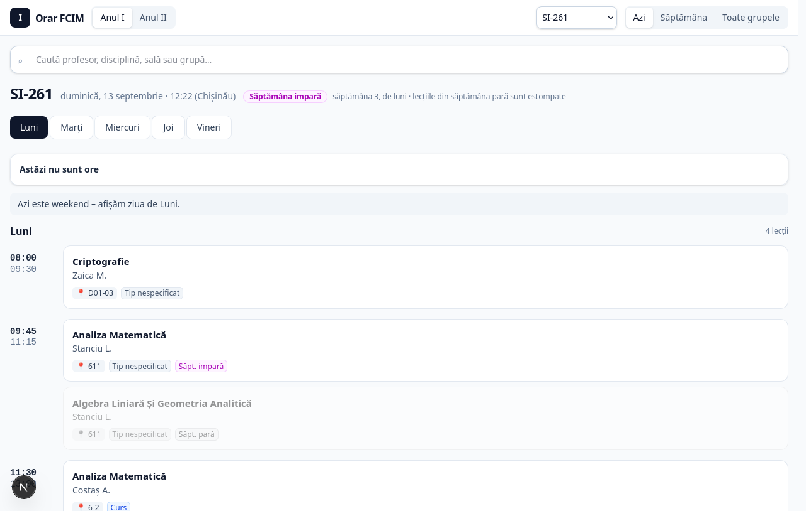
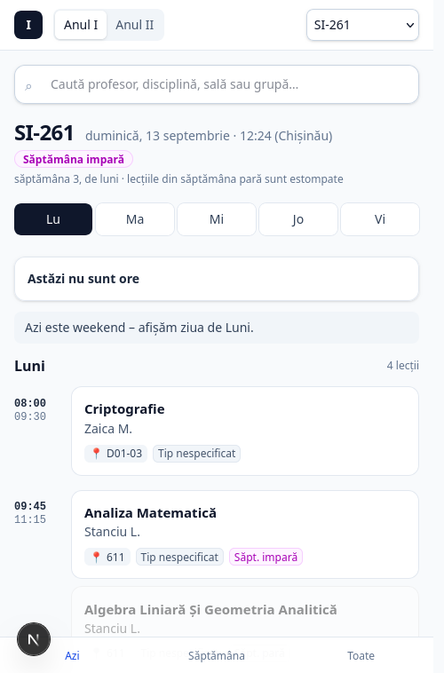

# Raport Implementare Task 3: Informații Live despre Lecții în Vizualizarea «Azi»

## 1. Descrierea Funcționalității

A fost adăugat un bloc informațional dedicat în modul «Azi» (`view === "today"`) pentru grupa selectată. Acest bloc afișează starea curentă a orarului raportată la timpul real al zilei de astăzi.

### Cele 4 stări gestionate:
1. **`current` (Acum)**: Se desfășoară o lecție în acest moment. Afișează denumirea disciplinei și intervalul `HH:MM–HH:MM`. În cazul subgrupelor sau disciplinelor simultane, toate materiile sunt enumerate.
2. **`next` (Urmează)**: În prezent nu este nicio lecție activă, dar urmează o lecție mai târziu astăzi. Afișează timpul rămas în minute (`peste N min`) și intervalul `HH:MM–HH:MM`.
3. **`finished` (Pentru azi nu mai sunt ore)**: Toate lecțiile planificate pentru ziua de astăzi s-au încheiat.
4. **`no_lessons` (Astăzi nu sunt ore)**: Pentru ziua de astăzi nu există lecții programate pentru grupa respectivă (sau este weekend).

---

## 2. Arhitectură și Logică de Timp

- **Intervale orare**: Logica folosește interval semi-deschis `[start, end)`. O lecție este considerată în desfășurare dacă `start <= now < end`. Când ora curentă atinge exact `end`, lecția este considerată încheiată.
- **Fus orar**: Toate calculele sunt sincronizate cu fusul orar al universității: `Europe/Chisinau` (obținut prin funcția existentă `localNow`).
- **Paritate**: Nu se duplică logica de paritate; se utilizează funcția standard a proiectului `lessonsThisWeek(lessons, week.parity)`.
- **Domain Helper**: Funcția pură `getAziScheduleStatus(lessons, now)` este amplasată în `src/lib/client/time.ts`.
- **Componenta UI**: `AziStatusCard` din `src/components/AziStatusCard.tsx`, integrată în `src/components/ScheduleApp.tsx`.

---

## 3. Comportament la Comutarea Zilelor (Day Switching)

- Blocul de status live este afișat **exclusiv** când utilizatorul vizualizează ziua curentă (`activeDay === todayName` sau `selectedDay === null`).
- Dacă utilizatorul comută pe o altă zi a săptămânii din bara de navigare, blocul de status live dispare automat pentru a nu induce în eroare.
- La revenirea pe ziua de astăzi, blocul de status live reapare instantaneu.

---

## 4. Teste Automate

Au fost adăugate 13 teste unitare în `tests/azi-status.test.ts`:
- Înainte de prima lecție a zilei (`next`, calcul corect al minutelor rămase).
- Exact la ora de start a lecției (`current`).
- În timpul desfășurării lecției (`current`).
- Exact la minutul de sfârșit al lecției (`next` pentru pauză sau `finished` pentru ultima lecție).
- În pauza dintre două perechi consecutive (`next`).
- Între perechi adiacente fără pauză (tranziție imediată la noua lecție `current`).
- Lecții paralele / subgrupe simultane (ambele materii incluse).
- După finalizarea tuturor lecțiilor zilei (`finished`).
- Zi fără lecții programate (`no_lessons`).
- Lecții furnizate neordonate (sortare corectă după `start_time`).

Rezultat suită de teste a întregului proiect:
- **15 fișiere de test rulate**
- **267 teste trecute cu succes (0 erori)**

---

## 5. Verificare Vizuală (Smoke Test)

### Desktop
- Cardul de status este poziționat deasupra orarului zilei și sub bara cu butoanele zilelor săptămânii.
- Respectă designul general Tailwind al aplicației (`rounded-xl border shadow-sm`).
- Butoanele de navigare rămân complet accesibile și vizibile.
- Nu există deplasări neintenționate de layout sau suprapuneri.

### Mobile (Viewport 390x844)
- Fără overflow orizontal (`scrollWidth === clientWidth`, `hasHorizontalOverflow === false`).
- Textul se încadrează armonios fără a fi retezat.
- Bara inferioară de navigare (`Azi`, `Săptămâna`, `Toate`) și timeline-ul rămân perfect utilizabile.

---

## 6. Capturi de Ecran

- Desktop: `docs/screenshots/task3-desktop.png`
- Mobile: `docs/screenshots/task3-mobile.png`

